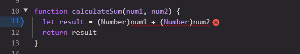

1. The bug was that the inputs num1 and num2 were strings, so the addition would lead to string concatenation.
2. To fix it simply typecast them to Number before parsing them into our calculateSum() function, then the function doesn't have to do typecasting again.  

